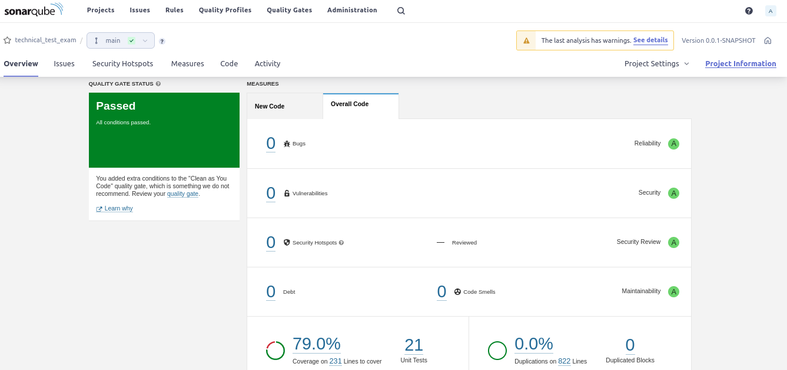
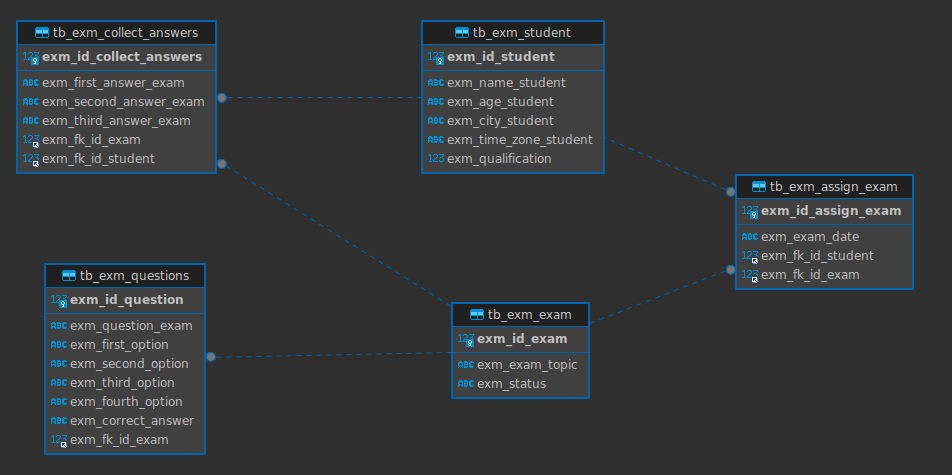

# Technical-Test-Exam
Prueba técnica FonYou

Componente que gestiona la creación de examenes, estudiantes y calificaciones.

# Descripción de funcionamiento.

# Cobertura Sonarqube.

# Modelo Entidad Relación.

# Tecnologías empleadas.

-------------------------------------
>- Java 11 + Spring boot
>- Lombok
>- Maven
>- Git
>- Junit
>- Mockito
>- Spring Data
>- JPA
>- Jacoco
-------------------------------------
